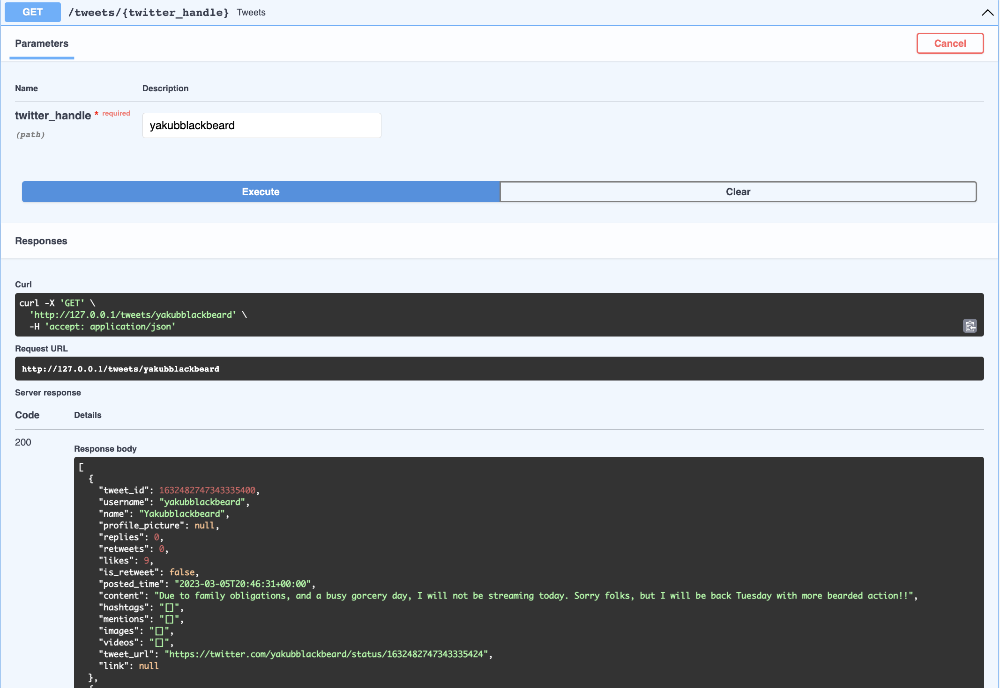
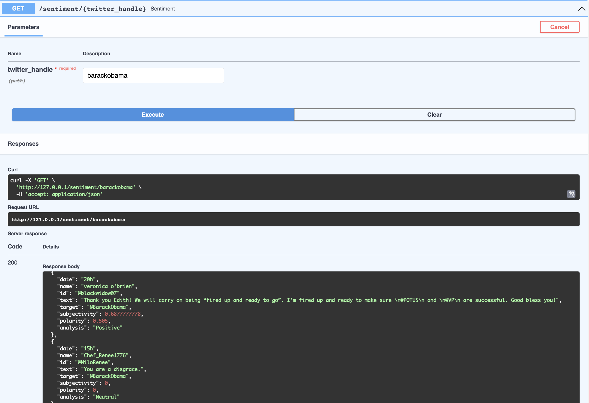

# Twitter Watch


How to install requirments:

```bash
pip3 install -r requirments.txt
```

How to run api server:

```bash
cd ./src/
hypercorn main:app --bind 0.0.0.0:80
```

The service will be on 0.0.0.0:80 and Swagger on 0.0.0.0:80/docs

### To-Do list
#### Data Mining

- [x] Get all tweets of a twitter user.
- [x] Get all mentions/replies from a specific tweet URL.
- [x] Get info about the audience.

#### Data Analyzing

- [x] Subjectivity and polarity of each mention/reply.
- [x] Sentiment each mention/reply.
- [ ] Sentiment each Persian/Farsi mention/reply.

#### Tools

- [x] Swagger.
- [ ] Better data cleaning for csv files.
- [ ] Use AI to make a summery of an account.
- [ ] UI/UX

#### Deployment

- [ ] Designing a good arch for project.
- [ ] Dockerize.
- [ ] Docker Swarm.


### Images



